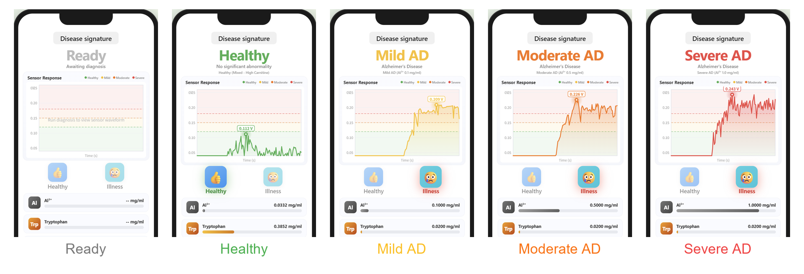
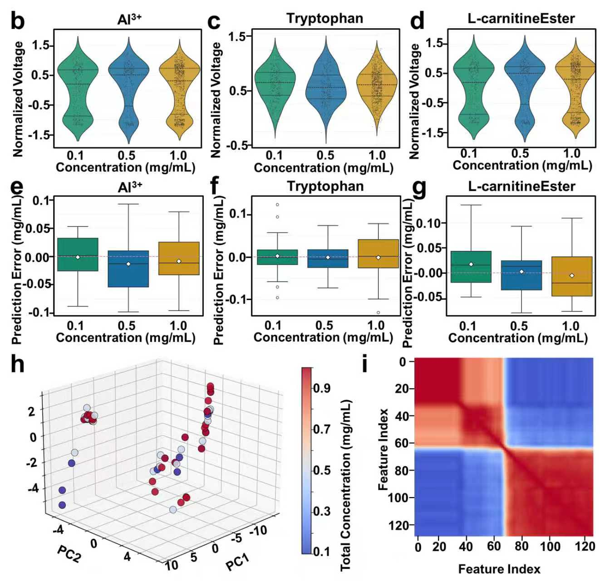

# AD Multi-parameter Diagnostic System

**Alzheimer's Disease Early Screening via Electrochemical Sensing with OSC-PLSR Multi-biomarker Quantification**

---

## Overview

This project implements a machine learning-based diagnostic system for early detection of Alzheimer's Disease (AD) using electrochemical sensor data. The system quantifies three key biomarkers — **Al³⁺ (Aluminum ion)**, **Tryptophan**, and **L-carnitine Ester** — from raw voltammetric waveforms, then classifies disease severity using a dual-criterion decision rule based on peak voltage and biomarker concentrations.

A smartphone-style web interface provides real-time visualization of sensor responses, biomarker concentrations with color-coded progress bars, and severity classification across four stages: Healthy, Mild AD, Moderate AD, and Severe AD.

---

## Diagnostic Interface

The system provides an intuitive phone-style UI showing real-time diagnosis results. The five primary states are shown below:



**Workflow overview figure:**



---

## Algorithm Pipeline

Our signal processing and prediction pipeline follows this architecture:

```
Raw Waveform
    │
    ├── Savitzky-Golay 1st Derivative  ──  Baseline drift & batch effect removal
    │
    ├── Orthogonal Signal Correction (OSC) ──  Remove concentration-irrelevant noise
    │
    ├── F-Score Feature Selection  ──  Keep only ~15% golden spectral bands (20 key points)
    │
    └── PLSR (Partial Least Squares Regression) ── Multi-biomarker concentration prediction
         │
         ├── Al³⁺ concentration
         ├── Tryptophan concentration
         └── L-carnitine Ester concentration
              │
              └── Dual-criterion severity classification
                   ├── Peak voltage thresholds
                   └── Al³⁺ concentration thresholds
```

### Preprocessing

1. **Savitzky-Golay Smoothing + 1st Derivative**: Eliminates constant baseline drift between measurement batches while preserving peak shapes.
2. **Orthogonal Signal Correction (OSC)**: Removes spectral variation orthogonal to the concentration matrix, effectively filtering out background noise and instrument-specific artifacts unrelated to target biomarkers.
3. **F-Score Feature Selection**: Ranks features by discriminative power and retains only the top 15% of spectral points, reducing dimensionality from hundreds of points to ~20 key features — significantly lowering overfitting risk.

### Prediction Model

**PLSR (Partial Least Squares Regression)** is used as the core regression model. PLSR projects both the predictor matrix (waveform features) and response matrix (biomarker concentrations) into a low-dimensional latent space, maximizing covariance between them — making it the industrial gold standard for multivariate calibration in chemometrics, especially when predictors exhibit high multicollinearity (as in spectral data).

Three independent PLSR models are trained for:
- Al³⁺ quantification
- Tryptophan quantification
- L-carnitine Ester quantification

### Severity Classification

| Severity | Peak Voltage (V) | Al³⁺ Concentration (mg/ml) | Color Code |
|----------|-----------------|---------------------------|------------|
| **Healthy** | ≤ 0.120 | < 0.05 | Green (#4caf50) |
| **Mild AD** | 0.120 – 0.150 | 0.05 – 0.30 | Yellow (#fbbf24) |
| **Moderate AD** | 0.150 – 0.180 | 0.30 – 0.75 | Orange (#f97316) |
| **Severe AD** | > 0.180 | > 0.75 | Red (#ef4444) |

---

## Experimental Results

### Model Performance (OSC-PLSR)

| Biomarker | Best Model | R² | RMSE (mg/ml) | Status |
|-----------|-----------|------|-------------|--------|
| **Al³⁺** | PLSR | **0.9964** | 0.0277 | ✅ Excellent |
| **Tryptophan** | PLSR | **0.9644** | 0.0745 | ✅ Excellent |
| **L-carnitine Ester** | PLSR | **0.9876** | 0.0390 | ✅ Excellent |
| **Average** | — | **0.9828** | — | **3/3 achieved** |

### Performance Improvement (Baseline → OSC-PLSR)

| Biomarker | Baseline R² | OSC-PLSR R² | Improvement |
|-----------|------------|-------------|-------------|
| Al³⁺ | 0.5465 | **0.9964** | +0.4499 |
| Tryptophan | 0.5728 | **0.9644** | +0.3916 |
| L-carnitine Ester | 0.8220 | **0.9876** | +0.1656 |

The OSC preprocessing + feature selection pipeline improved average R² from **0.6471** to **0.9828**, enabling accurate multi-biomarker quantification from single voltammetric waveforms.

---

## Project Structure

```
lyy-6.12/
├── app.py                          # Flask web server & API endpoints
├── osc_algorithm.py                # Core OSC-PLSR algorithm implementation
├── final_algorithm.py              # Finalized model training pipeline
├── templates/
│   └── index.html                  # Frontend UI (smartphone-style interface)
├── images/
│   ├── ui_composite.png            # UI state composite figure
│   ├── 微信图片_20260820171419.jpg  # Workflow overview figure
│   ├── fig1.png ~ fig5.png         # Paper figures
│   └── algorithm_architecture.png  # Algorithm architecture diagram
├── plots/                          # Analysis & performance plots
├── plots_en/                       # English-labeled paper figures
├── LYY-614/                        # Original Excel datasets
│   ├── 铝离子.xlsx                 # Al³⁺ dataset
│   ├── 色氨酸.xlsx                 # Tryptophan dataset
│   └── 烯酰肉碱.xlsx               # L-carnitine Ester dataset
├── models/                         # Trained model weights (.pkl)
│   └── (See model download below)
└── results/                        # Experimental result exports
```

---

## Model Weights

Pre-trained PLSR model weights (`.pkl` files, ~50MB total) are available via Baidu Netdisk:

- **Link**: https://pan.baidu.com/s/18tnsBqrIXASe-tb8Ku2oEQ
- **Extraction code**: `mpyu`

Download and place all `.pkl` and `.npy` files into the `models/` directory before running the application.

---

## Installation & Usage

### Requirements

```bash
pip install flask pandas numpy scikit-learn scipy matplotlib joblib pillow
```

### Run the Web Application

```bash
python app.py
```

Then open `http://localhost:5000` in your browser.

### Three Input Modes

1. **Upload (Preset samples)**: Select from 8 pre-loaded experimental samples (Healthy/Mild/Moderate/Severe with varying biomarker profiles).
2. **Peak (V)**: Manually input a peak voltage value (0.04–0.30 V) for threshold-based diagnosis.
3. **Al³⁺**: Manually input an Al³⁺ concentration (0–1.5 mg/ml) for concentration-based severity classification.

### Key Features

- 📊 Real-time waveform visualization with color-coded severity zones (green/yellow/orange/red) and threshold lines
- 🔬 Three biomarker concentration cards with animated progress bars
- 👍/😢 Healthy/Illness emoji indicators with glow effects
- 📱 Smartphone-frame UI design (380×840px, iPhone-style notch) optimized for paper figures
- 🌐 All-English interface for international journal publication

---

## Technology Stack

- **Backend**: Flask (Python)
- **Machine Learning**: scikit-learn (PLSR, StandardScaler), NumPy, SciPy (Savitzky-Golay filter)
- **Frontend**: Vanilla HTML/CSS/JavaScript with Canvas 2D waveform rendering
- **Visualization**: Matplotlib (analysis plots), Canvas API (real-time waveform)

---

## Author

**GodYYDS0417**
- Email: 2813028982@qq.com
- GitHub: [@GodYYDS0417](https://github.com/GodYYDS0417)

---

## License

This project is provided for academic research purposes.
