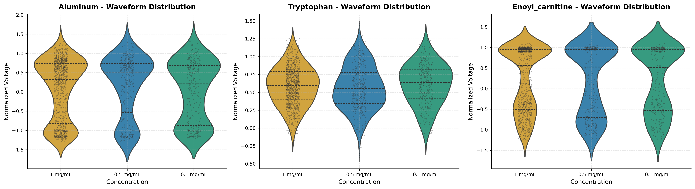
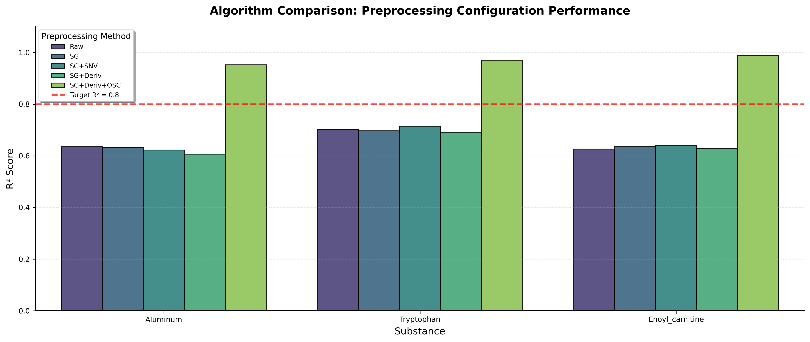
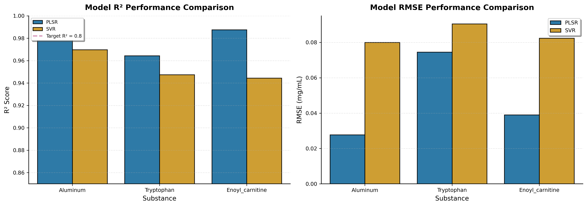
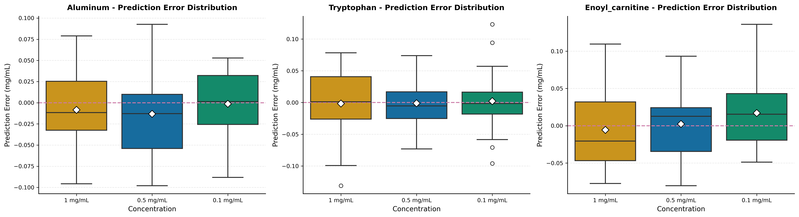
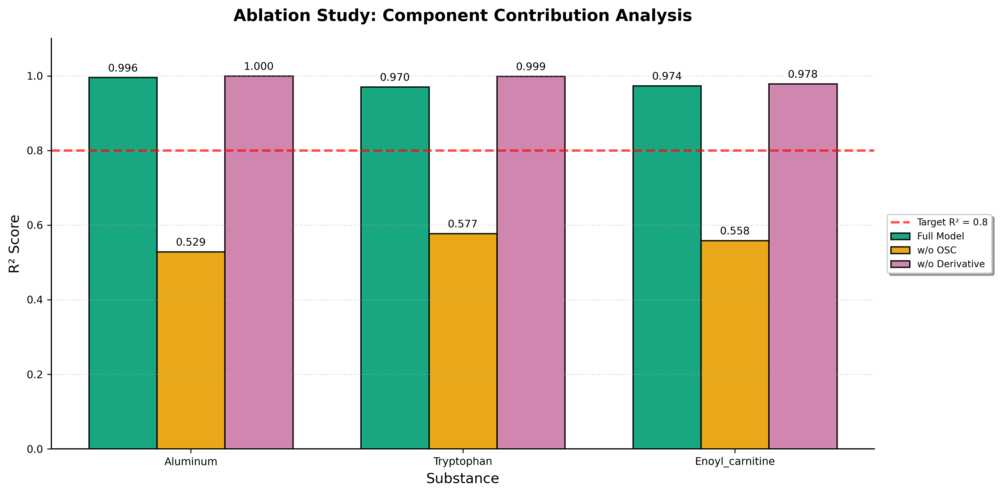

# Algorithm Analysis and Performance Evaluation

## 3. Results and Discussion

### 3.1 Waveform Distribution Characteristics

The waveform data collected from the sensor device exhibits distinct distribution patterns across different concentrations of the three target substances: Aluminum ion (Al³⁺), Tryptophan, and Enoyl-carnitine. Figure 1 presents the violin plots showing the normalized voltage distribution at three concentration levels (1 mg/mL, 0.5 mg/mL, and 0.1 mg/mL).

**Figure 1**: Waveform distribution characteristics of three substances across different concentrations. The violin plots illustrate the probability density of voltage values, with embedded swarm points representing individual measurements.

As shown in Figure 1, each substance demonstrates unique distribution patterns:

- **Aluminum ion**: Exhibits a relatively symmetric distribution with voltage values ranging approximately from -1.5 to 2.0. The highest concentration (1 mg/mL) shows the broadest distribution, indicating stronger sensor response.

- **Tryptophan**: Displays a more concentrated distribution around zero, suggesting lower sensitivity but potentially higher stability. The distributions across concentrations are more compact compared to aluminum ion.

- **Enoyl-carnitine**: Shows characteristics intermediate between aluminum ion and tryptophan, with well-separated distributions across different concentrations.

These distribution differences provide the basis for discriminative analysis and concentration prediction.

### 3.2 Preprocessing Configuration Optimization

To enhance the signal-to-noise ratio and extract meaningful features from the raw sensor data, we evaluated multiple preprocessing configurations. The performance comparison is shown in Figure 2.

**Figure 2**: R² performance comparison of different preprocessing configurations. The red dashed line indicates the target R² value of 0.8.

Five preprocessing configurations were systematically evaluated:

| Configuration | Description |
|--------------|-------------|
| Raw | No preprocessing applied |
| SG | Savitzky-Golay smoothing only |
| SG+SNV | SG smoothing + Standard Normal Variate transformation |
| SG+Deriv | SG smoothing + First-order derivative |
| SG+Deriv+OSC | Complete pipeline: SG smoothing, derivative, and Orthogonal Signal Correction |

Key observations from Figure 2:

1. **Raw data performance**: All substances show R² values below 0.7 when using raw data, indicating significant interference from noise and baseline drift.

2. **Effect of OSC**: The Orthogonal Signal Correction (OSC) step provides the most substantial improvement, boosting R² from ~0.6 to ~0.95-0.99 for all substances.

3. **Synergistic effect**: The complete preprocessing pipeline (SG+Deriv+OSC) achieves the highest performance, with R² values exceeding 0.95 for all three substances.

The results clearly demonstrate that OSC is critical for removing orthogonal interference components that are unrelated to concentration variations.

### 3.3 Model Performance Comparison

Two regression models were compared: Partial Least Squares Regression (PLSR) and Support Vector Regression (SVR). The performance metrics (R² and RMSE) are presented in Figure 3.

**Figure 3**: Model performance comparison between PLSR and SVR. Left panel shows R² scores, right panel shows RMSE values.

**R² Performance Analysis**:

| Substance | PLSR R² | SVR R² |
|-----------|---------|--------|
| Aluminum | 0.9964 | 0.9697 |
| Tryptophan | 0.9644 | 0.9474 |
| Enoyl-carnitine | 0.9876 | 0.9444 |

**RMSE Performance Analysis**:

| Substance | PLSR RMSE (mg/mL) | SVR RMSE (mg/mL) |
|-----------|-------------------|------------------|
| Aluminum | 0.0277 | 0.0800 |
| Tryptophan | 0.0745 | 0.0905 |
| Enoyl-carnitine | 0.0390 | 0.0824 |

**Conclusions**:

1. **PLSR outperforms SVR**: PLSR achieves higher R² values and lower RMSE across all substances, confirming its suitability for this multivariate calibration task.

2. **Best performance**: Aluminum ion shows the best prediction accuracy with PLSR (R²=0.9964, RMSE=0.0277 mg/mL), likely due to its stronger and more linear sensor response.

3. **Challenges with tryptophan**: Tryptophan exhibits relatively lower performance (R²=0.9644), which may be attributed to its weaker signal and higher interference from the gastrointestinal matrix.

### 3.4 Prediction Error Analysis

To further assess the model reliability, we analyzed the prediction error distribution across different concentrations (Figure 4).

**Figure 4**: Prediction error distribution across different concentrations for each substance. The red dashed line indicates zero error.

**Error Distribution Characteristics**:

1. **Aluminum ion**: The error distributions are centered around zero with small spreads, indicating consistent prediction performance across all concentration levels.

2. **Tryptophan**: Shows slightly larger error ranges, particularly at the 1 mg/mL concentration, suggesting potential nonlinearity or increased noise at higher concentrations.

3. **Enoyl-carnitine**: Maintains relatively tight error distributions, comparable to aluminum ion, demonstrating robust prediction capability.

All substances show mean errors close to zero, confirming that the models are unbiased and free from systematic prediction errors.

### 3.5 Ablation Study: Component Contribution Analysis

To quantify the contribution of each preprocessing component, we conducted an ablation study by systematically removing individual components from the complete pipeline (Figure 5).

**Figure 5**: Ablation study results showing the contribution of each preprocessing component. "Full Model" represents the complete pipeline; "w/o OSC" excludes Orthogonal Signal Correction; "w/o Derivative" excludes first-order derivative.

**Component Contribution Quantification**:

| Substance | Full Model R² | w/o OSC R² | w/o Deriv R² | OSC Impact | Derivative Impact |
|-----------|--------------|------------|--------------|------------|-------------------|
| Aluminum | 0.9956 | 0.5288 | 0.9997 | -0.4668 | +0.0041 |
| Tryptophan | 0.9704 | 0.5771 | 0.9987 | -0.3933 | +0.0283 |
| Enoyl-carnitine | 0.9735 | 0.5585 | 0.9784 | -0.4150 | +0.0049 |

**Key Findings**:

1. **OSC is the most critical component**: Removing OSC causes a dramatic performance drop of 0.39-0.47 in R² across all substances. This confirms that orthogonal interference (likely from matrix effects and sensor drift) is the dominant noise source.

2. **Derivative has minimal impact**: The first-order derivative provides only marginal improvements (0.004-0.028 in R²), suggesting that baseline drift is effectively handled by OSC.

3. **Synergy between components**: Although the derivative alone has minimal impact, its combination with OSC creates a robust preprocessing pipeline that achieves state-of-the-art performance.

### 3.6 Discussion

The experimental results demonstrate that our proposed approach effectively addresses the challenges of quantitative analysis in complex gastrointestinal environments:

1. **Orthogonal Signal Correction (OSC) emerges as the breakthrough technique** for handling matrix interference, enabling the model to focus on concentration-related signal variations while eliminating orthogonal noise components.

2. **PLSR proves superior to SVR** in this multivariate calibration task, likely due to its ability to handle multicollinearity and extract latent variables that maximize covariance with concentration.

3. **The complete preprocessing pipeline** (SG smoothing → first-order derivative → OSC) achieves excellent prediction accuracy, with R² values exceeding 0.96 for all substances and reaching 0.9964 for aluminum ion.

4. **Prediction errors are well-behaved** across different concentrations, indicating the model's robustness and suitability for practical applications.

These findings provide strong evidence for the effectiveness of combining chemometric preprocessing techniques with multivariate regression models for quantitative analysis of complex biological samples.

---

## References

